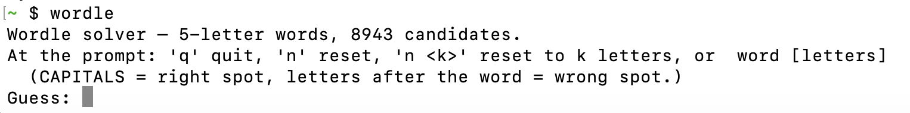

# Wordle Assist

This is a command-line tool that will assist you in playing Wordle.

The basic idea is that at the "guess:" prompt, you can enter a word and the tool will provide feedback on which letters are correct and in the correct position, and which letters are correct but in the wrong position.



The code uses a word list from Scrabble, but you can update the codebase to use a different word list, such as the word list from the official Wordle website or your operating system.

## Usage

```
$ wordle [n]
```

Where `n` is the length of words to use from the word list, defaulting to 5 if not specified.

At the "guess:" prompt, you can enter a word and the tool will provide feedback on which letters are correct and in the correct position, and which letters are correct but in the wrong position.  Enter the letters in lowercase and capitalize any letters in the correct location.  Any letters in the wrong location should be entered in lowercase after the word was entered.

After each guess, you will see a list of words that match the pattern you entered.  You'll also see a count of how many words remain of that word length.  You'll also see a list of possible letters for each position in the word.
You can enter "q" to quit the program.

You can enter "n [k]" to start a new game with a different word length `k`.  Or keep the same word length by not specifying `k`.

## Notes

The C++ version of this tool was used as a baseline for the Rust version.  It was a naive implementation that kept track of the letters available at each position in the word. 

The Rust version was created using Claude Code with the prompts related to how the C++ program worked.  The end result was an even better application.  It would remove more letters from the pool of possible letters for each position in the word by looking at the list of words and the constraints provided by the user.  For example, guessing "aRose" for the first word results in:
```
Wordle solver — 5-letter words, 8943 candidates.
At the prompt: 'q' quit, 'n' reset, 'n <k>' reset to k letters, or  word [letters]
  (CAPITALS = right spot, letters after the word = wrong spot.)
Guess: aRose
BRICK
BRILL
...
WRUNG
WRYLY
Available letters by position:
   1: BCDFGIKPTW
   2: R
   3: IUWY
   4: BCFGILMNPTVZ
   5: BDFGHIKLNPTYZ
68 of 8943 5-letter words remain
Guess: 
```
Based on the constraints and the words in the word list, the only letters remaining at the 3rd position are I, U, W, and Y.  The C++ version would have removed only the A, O, S, and E, leaving 22 letters remaining.


### Why Word Length Options?

A Vue.js version of Wordle was created to see how the game would look and feel with a different word length.  [You can try it out.](https://kdborg.com/kirkle/)  The difference is the selection of a word length and having as many guesses as you want.

It only made sense to add word length options to the command-line version of the assistant.
